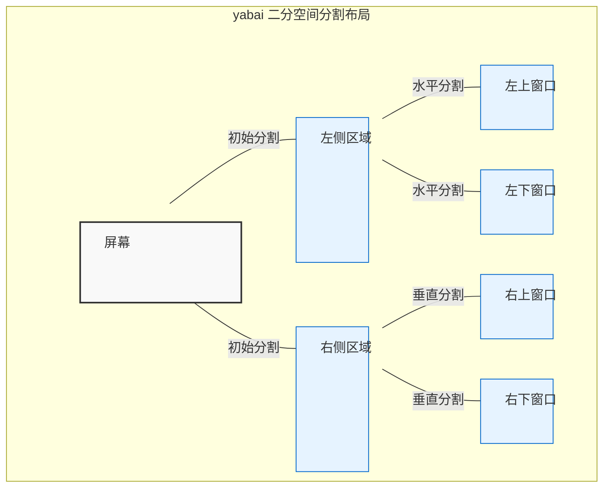
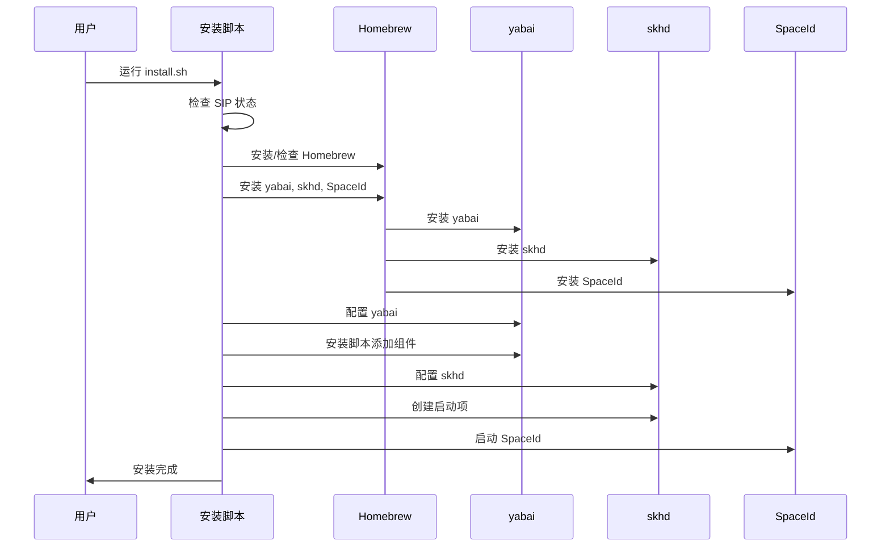

# YabaiAutoConfig

一键配置 yabai 窗口管理器和 skhd 热键守护进程的自动化脚本，适用于已关闭 SIP 的 macOS 系统。

## 效果展示

### 窗口布局示意图



### 安装流程图



## 前提条件

- macOS 系统（建议 Sonoma 或更高版本）
- 已禁用 SIP（System Integrity Protection）
- 管理员权限

## 功能特性

- 自动安装和配置 yabai 窗口管理器
- 自动安装和配置 skhd 热键守护进程
- 安装 SpaceId 在状态栏显示当前桌面编号
- 配置开机自启动
- 预设实用的窗口管理快捷键

## 快速安装

```bash
git clone https://github.com/yourusername/YabaiAutoConfig.git
cd YabaiAutoConfig
chmod +x install.sh
./install.sh
```

## 快捷键说明

### 窗口焦点切换
- `Alt + Shift + H/J/K/L`: 切换到左/下/上/右侧窗口
- `Alt + 方向键`: 切换到左/下/上/右侧窗口

### 窗口大小调整
- `Alt + H`: 左边框向左移动（窗口变宽）
- `Alt + J`: 左边框向右移动（窗口变窄）
- `Alt + K`: 右边框向左移动（窗口变窄）
- `Alt + L`: 右边框向右移动（窗口变宽）

### 工作区切换
- `Alt + I/O/P/[/]`: 切换到 1/2/3/4/5 号空间

### 窗口移动
- `Alt + Shift + I/O/P/[/]`: 将当前窗口移动到 1/2/3/4/5 号空间
- `Alt + Ctrl + H/L`: 将窗口与左/右侧窗口交换位置

### 其他功能
- `Alt + T`: 切换窗口浮动状态
- `Alt + F`: 切换窗口全屏

## 自定义配置

如果您想自定义配置，可以编辑以下文件：

- yabai 配置: `~/.yabairc`
- skhd 配置: `~/.skhdrc`

## 故障排除

### 检查服务状态
```bash
# 检查 yabai 状态
yabai --version
launchctl list | grep yabai

# 检查 skhd 状态
skhd -V
launchctl list | grep skhd
```

### 查看日志
```bash
# yabai 日志
cat /tmp/yabai_$(whoami).out.log
cat /tmp/yabai_$(whoami).err.log

# skhd 日志
cat ~/Library/Logs/skhd.log
```

### 常见问题

1. **工作区切换或窗口移动不起作用**
   - 确保 SIP 已禁用: `csrutil status`
   - 重新加载脚本添加组件: `sudo yabai --load-sa`
   - 重启 yabai 服务: `yabai --restart-service`

2. **快捷键不起作用**
   - 确保 skhd 服务正在运行
   - 检查是否有其他应用占用了相同的快捷键
   - 重启 skhd 服务: `launchctl unload -w ~/Library/LaunchAgents/com.zq.skhd.plist && launchctl load -w ~/Library/LaunchAgents/com.zq.skhd.plist`

## 卸载

如果您想卸载 YabaiAutoConfig，可以运行以下命令：

```bash
# 停止服务
yabai --stop-service
launchctl unload -w ~/Library/LaunchAgents/com.zq.skhd.plist

# 卸载软件包
brew uninstall yabai skhd
brew uninstall --cask spaceid

# 删除配置文件
rm ~/.yabairc ~/.skhdrc
rm ~/Library/LaunchAgents/com.zq.skhd.plist
sudo rm /private/etc/sudoers.d/yabai
```

## 许可证

MIT
